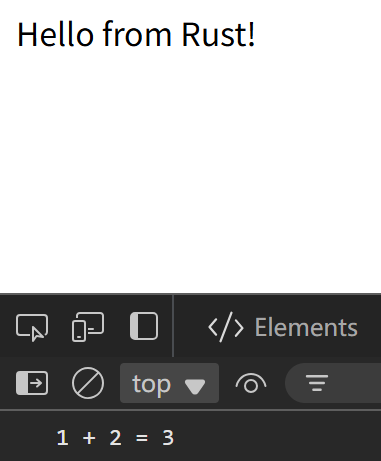

# Wasm Minimal

[](https://github.com/PRO-2684/wasm-minimal/blob/main/LICENSE)
[](https://github.com/PRO-2684/wasm-minimal/blob/main/.github/workflows/release.yml)
[](https://github.com/PRO-2684/wasm-minimal/releases)
[](https://github.com/PRO-2684/wasm-minimal/releases)
[](https://crates.io/crates/wasm-minimal)
[](https://crates.io/crates/wasm-minimal)
[](https://docs.rs/wasm-minimal)

Minimal template and step-by-step tutorial for developing Wasm with Rust.

## 💭 Preface

### ❓ Why?

The [`rustwasm` organization](https://github.com/rustwasm/) has been [deprecated](https://blog.rust-lang.org/inside-rust/2025/07/21/sunsetting-the-rustwasm-github-org/). Its [book](https://rustwasm.github.io/docs/book/) is not properly updated, and successors of tools like `wasm-pack` & `wasm-bindgen` are scattered across the community. Here's an incomplete table for reference:

| Project         | Old Maintainer                     | New Maintainer                     | Redirect? |
|------------------|------------------------------------|-------------------------------------|-----------|
| `book`          | [rustwasm](https://github.com/rustwasm/book) | /                                   | /         |
| `wasm-pack`     | [rustwasm](https://github.com/rustwasm/wasm-pack) | [drager](https://github.com/drager/wasm-pack) | 🟢       |
| `wasm-bindgen`  | [rustwasm](https://github.com/rustwasm/wasm-bindgen) | [wasm-bindgen](https://github.com/wasm-bindgen/wasm-bindgen) | 🟢       |

### 🚩 Goal

The main goal of this repo is to help you get started on making *minimal* and *modern* Wasm web apps:

- **Minimal**: You **do not** have to mess with NPM and bundlers like webpack.
- **Modern**: You'll have **TypeScript** definitions, and generated glue code will support **ES module** syntax, targeting **modern browsers**.

### 📃 Assumptions

Note that by continuing, we assume that you:

- Are familiar with Rust and Cargo, and have the [Rust toolchain](https://rustup.rs/) installed;
- Are familiar with HTML and JavaScript;
- Are only targeting modern browsers;
- Do not wish to mess with bundlers.

## 📖 Tutorial

### 🛠️ Install Necessary Tools

1. [Install `cargo-binstall`](https://github.com/cargo-bins/cargo-binstall?tab=readme-ov-file#installation):
    - It will help you install pre-compiled Rust binaries without having to compile them yourself.
    - If you do not want it, you can always replace `binstall` with `install`, or download binaries by yourself.
2. Install `wasm-pack`:
    ```bash
    cargo binstall wasm-pack
    ```
3. (Optional) Install `wasm-bindgen-cli`:
    ```bash
    cargo binstall wasm-bindgen-cli
    ```
4. (Optional) Install `wasm-opt` from [Binaryen](https://github.com/WebAssembly/binaryen/releases) by:
    1. Downloading the appropriate archive.
    2. Extracting `bin/wasm-opt(.exe)` to a position in your `$PATH`.

You can skip steps marked "Optional", and `wasm-pack` will download them ([`wasm-bindgen-cli`](https://github.com/drager/wasm-pack/blob/cd1718aa7babb656796b8aae3c177ddacce28028/src/command/build.rs#L424-L429), [`wasm-opt`](https://github.com/drager/wasm-pack/blob/cd1718aa7babb656796b8aae3c177ddacce28028/src/wasm_opt.rs#L54-L64)) to its own [cache directory](https://github.com/drager/wasm-pack/blob/cd1718aa7babb656796b8aae3c177ddacce28028/src/cache.rs#L9-L15).

### 📦 Initialize Your Project

1. Initialize your Rust project as a library:
    ```bash
    cargo new <slug> --lib # Or cargo init if you've already created a dedicated directory
    ```
2. Set `lib.crate-type` in your `Cargo.toml`:
    ```toml
    [lib]
    crate-type = ["cdylib", "rlib"]
    ```
3. Add the dependency `wasm-bindgen`:
    ```bash
    cargo add wasm-bindgen
    ```
4. Add the dependency `web-sys` with [features](https://github.com/wasm-bindgen/wasm-bindgen/blob/main/crates/web-sys/Cargo.toml#:~:text=[features]) you want:
    ```bash
    # For this tutorial, you may begin with:
    cargo add web-sys -F Document,Element,HtmlElement,Node,Window
    ```
5. Replace `lib.rs` with the following code as the starting point:
    ```rust
    use wasm_bindgen::{prelude::wasm_bindgen, JsValue};

    /// Add two numbers together.
    #[wasm_bindgen]
    pub fn add(left: u32, right: u32) -> u32 {
        left + right
    }

    // Called when the Wasm module is instantiated
    #[wasm_bindgen(start)]
    fn main() -> Result<(), JsValue> {
        let window = web_sys::window().expect("no global `window` exists");
        let document = window.document().expect("should have a document on window");
        let body = document.body().expect("document should have a body");

        let val = document.create_element("p")?;
        val.set_inner_html("Hello from Rust!");

        body.append_child(&val)?;

        Ok(())
    }
    ```

### 🏗️ Build

```bash
wasm-pack build --target web --no-pack
```

Your Wasm and glue code will be ready under `/pkg`:

- `<slug>_bg.wasm`: The Wasm file.
- `<slug>.js`: The glue code.
- `<slug>.d.ts` / `<slug>_bg.wasm.d.ts`: Type definitions.

### 🌐 Usage

Assuming that you've put `index.html` & `index.js` under the root of your project, so that your directory looks like:

```
.
├── Cargo.toml  # You must know what this is
├── index.html  # HTML for the website
├── index.js    # Script for the website
├── pkg         # Generated Wasm module & JavaScript glue code
│   ├── rust_wasm_test_2025_bg.wasm
│   ├── rust_wasm_test_2025_bg.wasm.d.ts
│   ├── rust_wasm_test_2025.d.ts
│   └── rust_wasm_test_2025.js
└─── src        # Rust source code
    └── lib.rs
```

In your `index.html`, import your script `index.js` as a `module`:

```html
<script type="module" src="./index.js"></script>
```

In your `index.js`, import and use the glue code:

```javascript
import init, { add } from './pkg/<slug>.js';

async function run() {
    await init(); // Initialize the Wasm instance

    const result = add(1, 2); // Calling exported `add` function
    console.log(`1 + 2 = ${result}`); // Log the result
    if (result !== 3)
        throw new Error("wasm addition doesn't work!");
}
```

Spin up the server with the tool you prefer, taking `http.server` in Python for example:

```bash
$ python3 -m http.server
Serving HTTP on 0.0.0.0 port 8000 (http://0.0.0.0:8000/) ..
```

Then open your browser and navigate to the server address. You should see the words "Hello from Rust!" on the web page, and "1 + 2 = 3" in your console:



## 🤔 What's next?

Feel free to explore more [examples](https://wasm-bindgen.github.io/wasm-bindgen/examples/index.html), [reference](https://wasm-bindgen.github.io/wasm-bindgen/reference/index.html), [`js-sys`](https://wasm-bindgen.github.io/wasm-bindgen/contributing/js-sys/index.html), and more at [The `wasm-bindgen` Guide](https://wasm-bindgen.github.io/wasm-bindgen/).

<!-- Source phase imports: [Usage](https://wasm-bindgen.github.io/wasm-bindgen/reference/deployment.html#module) / [Chrome Status](https://chromestatus.com/feature/5796131906519040) -->

## 🎉 Credits

- [Hello wasm-pack!](https://drager.github.io/wasm-pack/book/)
- [Without a Bundler - The `wasm-bindgen` Guide](https://wasm-bindgen.github.io/wasm-bindgen/examples/without-a-bundler.html)
- [Rust and WebAssembly](https://rustwasm.github.io/docs/book/) (Archived)

<!-- - [Command Line Interface - The `wasm-bindgen` Guide](https://wasm-bindgen.github.io/wasm-bindgen/reference/cli.html) -->
